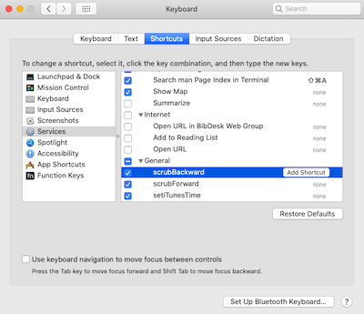
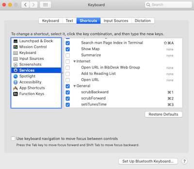

# iTunes Scrubber

A simple tool to scrub through iTunes songs. Allows you to skip forward 5 seconds, go back 5 seconds, and go to an inputed time.

## Installation

Should take <5 minutes. Requires MacOS 10.15 or later.

### Part 1 - Enabling Access

1. Go to `System Preference` > `Security & Privacy` > `Security`

2. Click on `Accessibility` on the left-hand panel and click the lock on the bottom right if it is currently locked

3. Click the `+` sign and add the app `Automator`. Then add `Finder` in the same way.

### Part 2 - Installing Workflows
1. Download this repository by clicking the `Code` button near the top of this page and click `Download ZIP` in the drop down.

2. Unzip the downloaded file and inside the `iTunes-Scrubber-master` folder, you will find a folder named `workflowFiles`.

3. Click into `workflowFiles` and double click every file. You will be asked whether you want to **"Install the Quick Action"** for each file. Make sure to select install.

### Part 3 - Binding Commands to Keys

1. Go to `System Preference` > `Keyboard` > `Shortcuts`

2. Click on `Services` on the left-hand panel and scroll to the bottom of the right-hand panel. You should see the three new commands `scrubBackward`, `scrubForward`, and `setiTunesTime`.

3. Make sure to tick all the boxes for the new command. For each command click on it,  click `Add Shortcut` and input a keyboard shortcut by pressing keys simultaneously. (Read next step for recommended bindings)

4. Recommended bindings are...
    - `scrubBackward` - ⌘1
    - `scrubForward` - ⌘2
    - `setiTunesTime` - ⌘3

(Use these bindings so that these new services are not in conflict with built-in shortcuts)

5. The keyboard shortcuts should work now, if they do not try restarting your computer, that generally seems to fix issues.

## Usage

After following the installation you will be able to do the following.

| Command      |  Recommended Keyboard Shortcut |  Behavior |
| -------------| ----------| --|
| scrubBackward| ⌘1        | Moves the iTunes player 5 seconds back|
| scrubForward | ⌘2        | Moves the iTunes player 5 seconds forward |
| setiTunesTime| ⌘3        | Takes an input time in the form `ss`, `mm:ss`, or `hh:mm:ss` and moves the iTunes player to that time  |

## Fun Stuff

Applescript is pretty cool. Though I don't think one would use it for much other than fun Mac automations, it is very readable and that makes it easy to learn and work with. Looking through the documentation is a lot less painful when the code is basically English.
