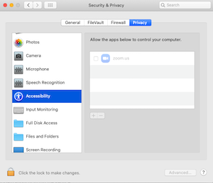
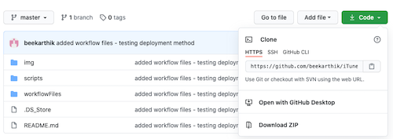

# iTunes Scrubber

A simple tool to scrub through iTunes songs. Allows you to skip forward 5 seconds, go back 5 seconds, and go to an inputed time.

## Installation

Should take <5 minutes.

### Part 1 - Enabling Access

1. Go to `System Preference` > `Security & Privacy` > `Security`

2. Click on `Accessibility` on the left-hand panel and click the lock on the bottom right if it is currently locked

3. Click the `+` sign and add the app `Automater`. Then add `Finder` in the same way.

### Part 2 - Copying over the code
1. Download this repository by clicking the `Code` button near the top of this page and click `Download ZIP` in the drop down.

2. Unzip the downloaded file and inside the `iTunes-Scrubber-master` folder, you will find a folder named `workflowFiles`. Click into that folder and double click every file. You will be asked whether you want to "Install the Quick Action" for each file. Make sure to select install.

### Part 3 - Binding the Scripts to the Key

1. Go to `System Preference` > `Keyboard` > `Shortcuts`

2. Click on `Services` on the left-hand panel and scroll to the bottom of the right-hand panel. You should see the three new commands `scrubBackward`, `scrubForward`, and `setiTunesTime`.

3. Make sure to tick all the boxes for the new command. For each command click on it,  click `Add Shortcut` and input a keyboard shortcut by pressing keys simultaneously.

4. Recommended bindings are...
    - `scrubBackward` - ⌘1
    - `scrubForward` - ⌘2
    - `setiTunesTime` - ⌘3

(Use these bindings so that these new services are not in conflict with built-in shortcuts)

## Usage

After following the installation you will be able to do the following.

| Command      |  Recommended Keyboard Shortcut |  Behavior |
| -------------| ----------| --|
| scrubBackward| ⌘1        | Moves the iTunes player 5 seconds back|
| scrubForward | ⌘2        | Moves the iTunes player 5 seconds forward |
| setiTunesTime| ⌘3        | Takes an time input in the form `ss`, `mm:ss`, `hh:mm:ss` and moves the iTunes player to that time  |
